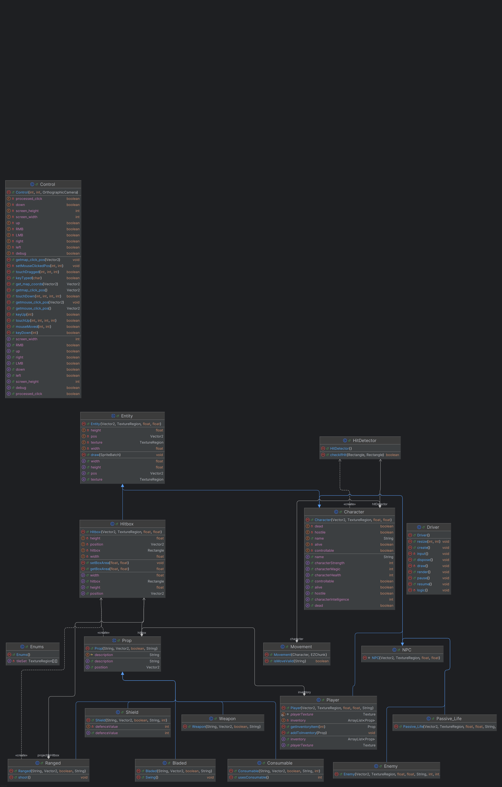
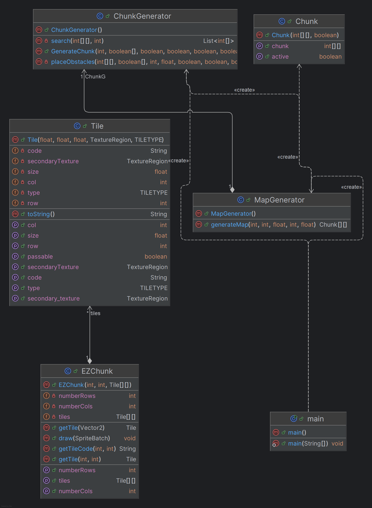
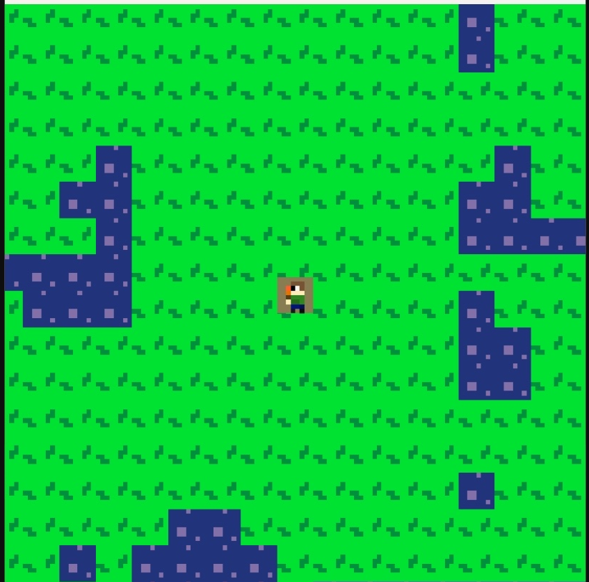

# CIDS-343-Group-6-Project
## Overview
This project is a rogue-like game developed in CIDS 343,
during the Spring Semester of 2025. This project
uses the LIBGDX game framework. It consists of a
randomized map generator, and a prop/character class 
with many child classes which they contain as well. 

These components combine together to achieve the goal
of making a simple, yet fun and replayable rogue-like
game that you can enjoy for many hours. 

## Design

This Uml diagram shows the layout of the entities, and our of our game
movement and controls as well.

### Control

The control class is how we move our player character in the game.
it uses many different values to check what directon the user is intending to 
move in. with direction booleans. Note that this class was copied online
from someone who made a similar game in the past, so we did not use all of the 
components that this class comes with.

*data fields*

These are the direction booleans to keep track of the directon of intended 
movement
- up 
- down
- left
- right

And then mouse booleans such as
- LMB
- RMB
- processed_click

there are also Vector2 variables. [^1]

[^1]:vector2 data types are linear 2d lines that can be 
used on a LibGDX screen for map positioning

These variables are 
- mouse_click_pos
- map_click_pos

these varables keep track of where on the screen the mouse was clicked
and where on the map that the mouse was clicked.

There is a debug boolean included for entering a debugging mode, and then
integers for keeping track of the 
- screen_width
- screen_height

*methods*

all of these varables have their own getters and setters as well

The constructor for this class takes the screen width and height
as well as instance of an orthographic camera to keep the camera
on the player.

The method setMouseClickedPos sets the mouse position on the screen and map 
when the mouse is clicked using the inputs of the x and y values on the screen

The method get_map_coords returns a vector 2 data type of the coordinates on the map
with an input of a Vector2 called the mouse_coords

Next, there is a method that returns a boolean called KeyDown which uses a switch
case based on common computer gaming controls to see if a key has been 
pressed down, if so it assigns true to a direction data field and then returns false
at the end to reset the key press condition. 

With KeyDown, there is KeyUp which changes the direction value associated with the 
key back to false based on a switch statement from before. this method also includes 
checks for the escape button to exit the game, as well as backspace to enter a debugging mode.

There is a method called KeyTyped that just currently returns false, which may be used later

The next method is called touchDown, it takes the x and y coordinates of the screen
and an integer called pointer. it checks if the left or right mouse button was pressed
and then sets LMB or RMB to true for use later.

There is also a touchUp method which resets LMB or RMB back to false.
both touchup and touchdown call setMouseClickedPos as well to set the postion 
on the map of where the mouse was clicked on the screen.

the next method called touchDragged is for the case of someone dragging a clicked mouse
across the screen, where it call setMouseClickedPos and gives it an x,y pair from the arguments
it is inputted, it then returns false at the end

the final method is called mouseMoved which currently does not do much, and just 
returns false.

### Movement

the movement class is how objects move throughout the screen.
it is dependent on the chunk class from the map through a compositon relationship

*Data Fields*

the data fields for Movement include
- an instance of Character
- an instance of Chunk
- a 2d array of tile instances

*Methods*

The constructor for this class takes a character instance and a chunk instance
and then sets the character and chunk data fields to what was put in for the arguments
the tiles array is then set up by using a method from the chunk class called 
getTiles to get each individual tile.

the isMoveValid method takes a string called direction to check and see if 
the move that a user is trying to make is valid according to the 
characters current position on the map. it then takes the direciton 
and then puts it in a switch statement in the method and checks the position
the user wants to move to based on its current position. Each tile has a integer 
assigned to them that dictates whether something can move there, if the integer
is not 1, then something cannot move to that tile and the mehtoud would return fase 
and the move would be invalid.

### Driver

The driver is like the main method of a java program, where all the objects come
together to make the whole game. Driver is part of LibGDX and is where you
create the gameplay loop based off of the objects you created. note this 
method implements applicaiton listener to help make the game run 
consistently.

*Data Fields* 

the driver contains
- a instance of SpriteBatch called spriteBatch [^2]
- a instance of Orthographic camera called camera
- a instance of FitViewport called viewport:
- a instance of Texture
- a instance of Sprite
- a Vector2 variable called touchPos
- 2 rectangle variables for 2 different sets of sprites

[^2]:a SpriteBatch is a group of Sprites in your game to give
your visible objects a visible asset, they are put all in 1 to load 
at once and make the game more efficient.

*methods*

the create method makes the map and the camera fit together at the beginning of the 
game, and loads other assets as well.

the resize method updates the viewport and changes its size 
to fit with a new screen size, as well as resetting the camera accordingly

The render method is a method that is called constantly 
while the game is running, this is where most of the game runs.
This method call the input, logic, and draw methods which will be expanded
upon later, with every time this method runs though, it makes a frame in the game.

The input method is where user input is taken, we have it empty currently 
but will add to it in the future. this is like the controller in a model view 
controller architecture (mvc).

the logic method is where the game logic goes, such as hitboxes, 
converting user input into making the player move, etc. this is like the model
in mvc.

then there is the draw method, which is where the assets are added into the 
screen of the game by adding a spritebatch, updating the camera, etc.
this is the view in mvc.

libGDX also has other method too for the game, such as pause, to pause the 
game and add a pause screen, etc, currently unused, a resume to unpause the game
currently unused, and a dispose method, which deletes spritebatches and textures
for when they are uneeded, or delete all the assets being used when the game is 
over.

### Entity

Entity is the mother of all objects that are going to be 
represented physically in our game it is a parent class to
character and prop.

*Data Fields*

Entity comes with
- Vector2 called pos
- TextureRegion called texture
- float called width
- float called height

*methods*

The constructor takes a vector 2 postion, texture region texture, floats width and 
height and sets the data fields to the arguments given.

the method draw takes a spritebatch that would be given from the driver
to draw the texture of the entity on the screen

the rest of the methods are basic getter and setter methods

### Enums

This class is for setting textures on a map using Enums to assign 
textures to look a certain way. it goes through a 2d array 
of texture regions and makes a tile set assigning certian tiles 
of the map to either grass or water currently.

### Prop

the prop class is the main parent of all the prop classes in our 
project, it is also a child of Entity. It is dependent on 
a class called HitBox, because of a composition relationship.

*Data Fields*

the prop class contains most of the data fileds that all 
props use, including

- String name the name of the prop
- Vector2 position, the position of the prop on the map/screen
- boolean isInteractive, can the prop be interacted with
- boolean isDestoryed, is the prop destroyed or not
- String description, the description of the prop
- a instance of Hitbox (this will be explained later) called hitbox

*Methods*

The constructor of this class takes a string name, vector2 postiion, boolean is 
interactive, and a string for the description, it then assigns 
values to the enitity constructor and assigns the rest of the attributes
from the arugmets to its own data fields. the constructor also creates a new 
hitbox object.

there is a method for getting the description of the object and 
setting the position of the prop as well.

### Consumable

consumable is a child of the Prop class and is meant for 
consumable props that may not be on the screen, but the characters 
may use for purposes

*Data Fields*
the consumable class has only one varable, and int called ConsumableValue
this is storing a value that could be used for a health potion, poison, shield
etc, it is open-ended to fit multiple purposes in other classes.

*Methods* 
the consumable constructor takes the same parameters as the prop class, 
just adding an int for consumableValue.

then there is a method that returns ConsumableValue called usesConsumable.
It is basically a getter with a fancy name.

### Weapon

Weapon is a child of Prop and a super class to ranged and bladed classes

This class is primarialy for organizational purposes and only has a constructor 
with a string for name, vector2 for position, boolean for isinteractive, and a 
string for description, this class it not inteded to by used by itself

### Bladed

Bladed is a child of the Weapon class is made to represent bladed weapons
that a character may use.

*Data Fields*

it has no data fields itself and uses data fields from the higher level classes
that it is a child of.

*Methods*

Bladed has one method called swing. this method is how a character would 
attack with a bladed weapon. how it works is that it would store the old width and 
height of its hitbox and then increase the width and height by a set amount 
for a set period of time, and then return to its old width and height.

the old width and height variables are only inside the method so when the 
method is complete they are garbage collected and wont hoard any extra space in
memory.

### Ranged

the ranged class is a child of the weapon class is is made to represent 
ranged weapons in our game.

*Data Fields*

it contains a vector2 called projectilepos
and a instance of hitbox called projectilehitbox

*Methods*

the constructor takes the same inputs as the weapon parent and adds them to 
the prop super constructor.

the only method here is called shoot
it conains a integer value called distance
then it created a new vector2 object for the projectile position
and a new hitbox called projectileHitbox
then there is a while loop that runs while the distance is less than 200
while this is happening the y value of the projectile position is increasing 
and the hitbox position is constantly set to the hitbox position to keep them together
the distance keeps increasing until it reaches 200 and then the projectile stops.

### Shield

The shield class is currently the final child of the prop class, which is supposed 
to represent a shield that a character will hold. 

*Data Fields*

Shield only has 1 data field, which is an int called defenceValue
this number is for when a character takes damage, this value would decrease the 
damage taken for the character

*Methods*

the constructor is just like the prop constructor, but with the defencevalue 
integer, and sets the defencevalue according to the argument given

there is also a getter for defencevalue

### Character 

The character class is the parent class if all the different 
character types in our game 

*Data Fields*

this class has many datafields, for either character states
or character attributes. 
the character states are booleans and incluse
- controllable
- alive
- dead
- hositle

the attributes are all ints except for name, which include
- string name
- int character_health
- character_Strength
- character_magic
- character_intelligence

these attributes are meant to change values with prop interactions.

The class also creates a rectangle for hit detection 
and calls a hitDetector creating a composition relationship.

*methods*

the constructor calls a vector2 for position, a textureregion called texture, 
float for the width and height. It applies these to the entity super constructor when needes 
and sets the hitboxes position according to the vector2 x and y coordinates.

the rest of the methods are getters and setters.

### player 

the player class is a child of character and is the class that the 
user would use to play as someone in the game.

*Data fields* 

the player has its own Texture it stores
the player also has a arraylist of props called inventory, the player aggregates 
many props and stores them in a arraylist to be accessed later.

*Methods*

there is a texture method called getPlayerTexture which returns playerTexture 
and a getter for the inventory

and a method called addtoinventory which takes a prop as a parameter and 
add a prop to the inventory with the built in array list add method
there is also a method called getInventoryItem that takes a specific index to 
receive a specific inventory item.

### NPC 

The npc is just a empty class but a child of Character to organize non player character classes, it is not 
meant to be used but does have a constructor.

### Passive_Life

the passive_life class is a child of NPC to represent characters that just 
hang out in the map or roam around without attacking the player 

*Data Fields*

all data fileds come from character

*Methods*

the constructor is the same as Character but also has arguments to change the 
character attributes

### Enemy

The enemy is a child of Character and is what the player fights
the constructor is nearly the same as passivelife but the enemy is set to hostile to 
the player

### Hitbox

the hitbox is a invisible rectangle that is meant to serve as a hitbox
for all objects on the map. most of the objects that show up on the map
are dependent on the hitbox

*data fields* 

the hitbox has a rectangle named hitbox that is the hitbox itself
it also has a vector2 called position 
and floats named width and height

*Methods*

the constructor takes a postion, texture (for the entity), and a width and height
and sets everything according

there are getters and setter for the hitbox as well

### HitDetector

*Data Fields* 
the hitdetector is what takes hitboxes and sees if they are hitting.
there is a boolean called isHit that keeps track if two hitboxes are hitting each other

*Methods*

the constructor just sets the HitDetector to false

the other method called checkIfHit takes two rectangles(two other hitboxes) and sees
if they are overlapping with the rectangle.overlaps method and sets isHit to true
or false if they are overlapping or not and returns ishit afterwards.

### Map Package

the map package is where the map of the game is stored. 

### Tile

the tile class is the smallest portion of the whole map. 

*Data Types*

float size
ints row and column
textureRegion secondaryTexture
tiletype type
string code

*Methods* 

the tile constructor takes a value for all of the data fields in it
and sets the data fields according to each value.

there are getters and setters

there is also a method called isPassable that returns true or false 
depending on if the tiletype is grass or not

then there is a toString method that turns the posDocumentation/Game_Example.pngiton of the tile into a 
string

### Chunk

the chunk is a set of codes for tiles. depedning on the code,
a player would be able or unable to pass through the tile.

*Data Fields*

- 2d int array chunkmap
- boolean named activeChunk

*Methods*

the constructor takes a 2d array of ints called thingy to pass to the chunkmap and 
sets the boolean to true or false with the parameter active.

there are getters for activechunk and chunkmap

### ChunkGenorator/MapGenorator

These two classes use complex algorithms to make a randomized
chunk and map in the game the mapgenorator depends on chunkgenorator
because of a compositon relationship

*How the classes work*

(Example will use a size 9 generation)
I generate the level first, a 9x9 array where each element will be a 'chunk'
After generating the 'Level' each nonzero element will generate a chunk
Within each chunk, each border will be known (Which chunks this generated chunk will be
adjacent to)
Generate the chunk randomly until all 'doors' (the middle border adjacent tiles) connect
with the main map
Spread until the map touches all doors

### Main

there is a main method for creating a map as well.
used for tesing purposes

# Examples

this is our game running with a player sprite in the center of a randomized map
where they are able to walk around.

# Status

currently we have the map genorator working with a instance of 
a player being able to walk around it. we would have liked to have 
gotten further, but with the diffuclty of the randomized map genorator.
we had to devote much of our time working on that. but we are in a great spot to
integrate the more logic based components of our game together 
to make a complete product!

